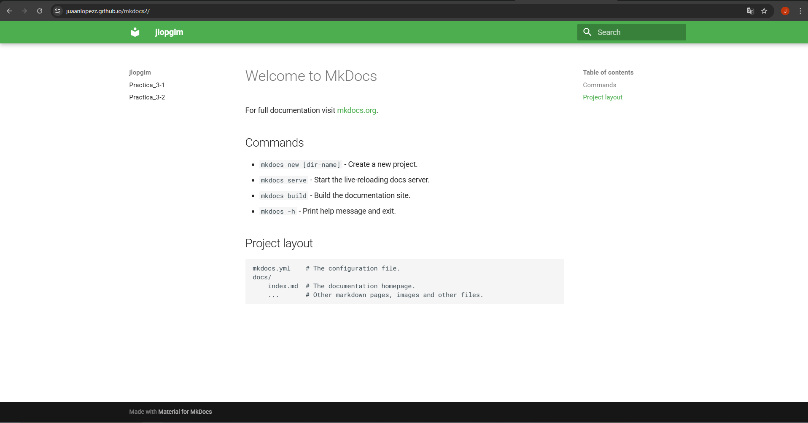

# práctica de MkDocs y GitHub Pages

## 1º Paso: Crear un nuevo proyecto

```
docker run --rm -it -p 8000:8000 -u $(id -u):$(id -g) -v "$PWD":/docs squidfunk/mkdocs-material new .
```

## Archivo de configuración mkdocs.yml, donde se definirán el nombre del sitio y a qué navegar
```
site_name: jlopgim
nav:
  - Practica_3-1: practica3-1.md 
  - Practica_3-2: practica3-2.md 

theme:
  name: material
  palette:
    primary: green
```
## Generar la documentación con el siguiente comando con el comando build:
```
docker run --rm -it -u $(id -u):$(id -g) -v "$PWD":/docs squidfunk/mkdocs-material build
```

## Publicar la documentación en GitHub Pages
```
docker run --rm -it -v ~/.ssh:/root/.ssh -v "$PWD":/docs squidfunk/mkdocs-material gh-deploy
```

# Creación de un workflow de CI/CD en GitHub Actions para pubicar un sitio web en GitHub Pages
## para crear un workflow en GitHub Actions podemos hacerlo de dos formas:

### Desde la sección Actions -> New workflow.
### Creando un archivo YAML dentro del directorio .github/workflows, en nuestro repositorio.

## En nuestro caso, vamos a crear un archivo con el nombre build-push-mkdocs.yaml. Por lo tanto, nuestro repositorio quedará así:
```

name: build-push-mkdocs

# Eventos que desescandenan el workflow
on:
  push:
    branches: ["main"]

  workflow_dispatch:

# A workflow run is made up of one or more jobs that can run sequentially or in parallel
jobs:

  # Job para crear la documentación de mkdocs
  build:
    # Indicamos que este job se ejecutará en una máquina virtual con la última versión de ubuntu
    runs-on: ubuntu-latest
    
    # Definimos los pasos de este job
    steps:
      - name: Clone repository
        uses: actions/checkout@v4

      - name: Install Python3
        uses: actions/setup-python@v4
        with:
          python-version: 3.x

      - name: Install Mkdocs
        run: |
          pip install mkdocs
          pip install mkdocs-material 

      - name: Build MkDocs
        run: |
          mkdocs build

      - name: Push the documentation in a branch
        uses: s0/git-publish-subdir-action@develop
        env:
          REPO: self
          BRANCH: gh-pages # The branch name where you want to push the assets
          FOLDER: site # The directory where your assets are generated
          GITHUB_TOKEN: ${{ secrets.GITHUB_TOKEN }} # GitHub will automatically add this - you don't need to bother getting a token
          MESSAGE: "Build: ({sha}) {msg}" # The commit message


```
## El último paso que tendremos que realizar será configurar los permisos que tendrá el GITHUB_TOKEN cuando se ejecute el workflow en este repositorio.

### Para configurar el repositorio seleccionamos: Settings -> Actions -> General.

### Buscamos la sección Workflow permissions y seleccionamos la opción Read and write permissions.


## MUY IMPORTANTE TENER 2 RAMAS EN EL GITHUB, la del main( que viene por defecto) y la del gh-pages (hay que crearla)


## asi sería el resultado final, he creado un archivo dentro de docs, llamado practica3-1.md donde se refleja todo el readme del markdown de las prácticas anteriores, eso se refleja en el navegador como se ve en las siguientes iamgenes, accediendo a : 
```
https://juaanlopezz.github.io/mkdocs2/practica3-1/
```
## pagina readme .md del repo 3.1:


## pagina readme .md del repo 3.2(lo agregué despues, ojo que hay que añadirlo al mkdocs.yml el archivo, el archivo practica3-2.d se crea dentro de docs, todos los readme que querramos poner habrá que añadirlos en esa ruta):

## el archivo final quedaría asi:
```
site_name: jlopgim
nav:
  - Practica_3-1: practica3-1.md 
  - Practica_3-2: practica3-2.md 

theme:
  name: material
  palette:
    primary: green

```

## pagina principal (despues de haber añadido la 3.2):


## pagina index.md personalizada:


## asi tendria que quedar la estructura del repositorio
